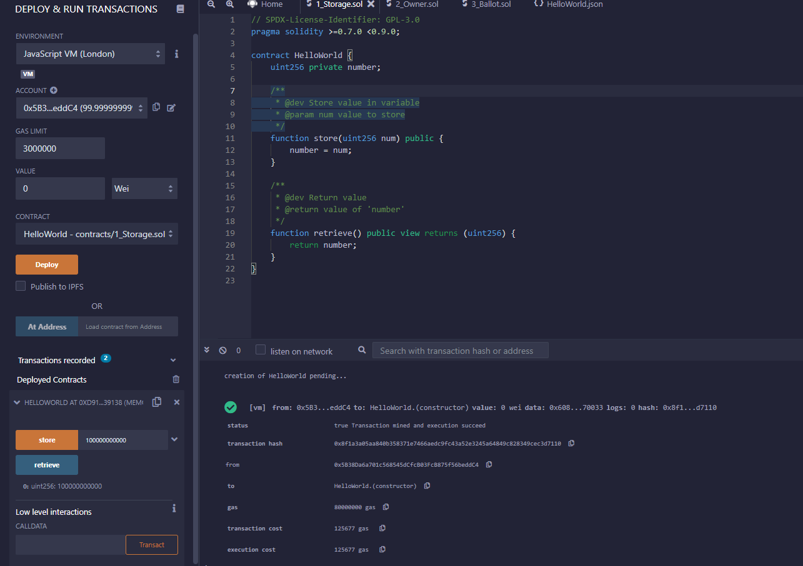
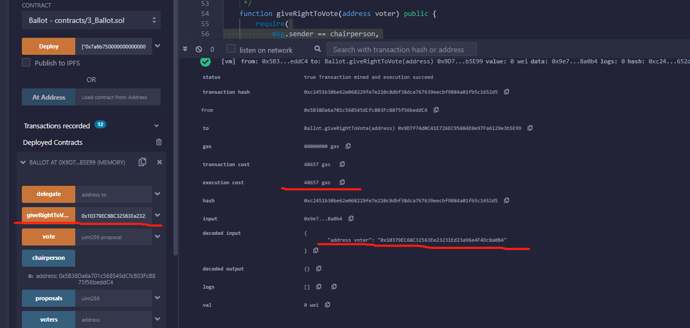
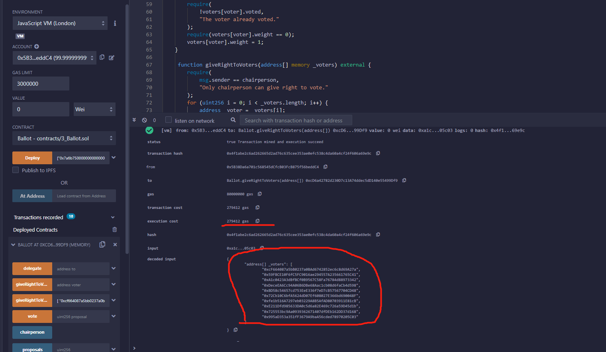

#  “Hello World” smart contract

## solidity code


```javascript
// SPDX-License-Identifier: GPL-3.0
pragma solidity >=0.7.0 <0.9.0;

contract HelloWorld {
    uint256 private number;

    /**
     * @dev Store value in variable
     * @param num value to store
     */
    function store(uint256 num) public {
        number = num;
    }

    /**
     * @dev Return value
     * @return value of 'number'
     */
    function retrieve() public view returns (uint256) {
        return number;
    }
}

```

## screenshot



# Ballot

## solidity code

write a batch function(giveRightToVoters) for reducing the number of transactions in the “giveRightToVote” function.The code is as follows:

```javascript
/**
* @dev Give 'voters' the right to vote on this ballot. May only be called by 'chairperson'.
* @param _voters addresses of voters
*/
function giveRightToVoters(address[] memory _voters) external {
    require(
        msg.sender == chairperson,
        "Only chairperson can give right to vote."
    );
    for (uint256 i = 0; i < _voters.length; i++) {
        address  voter = _voters[i];
        if (!voters[voter].voted && (voters[voter].weight == 0)) {
            voters[voter].weight = 1;
        }
    }
}
```

## gas cost

giveRightToVote:


the gas cost of giving 1 voter the right to vote is 48657.So the gas cost of giving 10 voters the right to vote is 486570.

giveRightToVoters:


the gas cost of giving 10 voters the right to vote is 279412.


<!--
## deploy

constructor params: ["0x7a6b750000000000000000000000000000000000000000000000000000000000"]

```
"address[] _voters": [
		"0x10379EC68C32563Ee23231Ed23a96e4F4Dc8a0B4"
	]
```


```
[0x10379EC68C32563Ee23231Ed23a96e4F4Dc8a0B4, 0x10379EC68C32563Ee23231Ed23a96e4F4Dc8a0B5,0x10379EC68C32563Ee23231Ed23a96e4F4Dc8a0B6,0x10379EC68C32563Ee23231Ed23a96e4F4Dc8a0B7, 0x10379EC68C32563Ee23231Ed23a96e4F4Dc8a0B8, 0x10379EC68C32563Ee23231Ed23a96e4F4Dc8a0B9, 0x10379EC68C32563Ee23231Ed23a96e4F4Dc8a0BA, 0x10379EC68C32563Ee23231Ed23a96e4F4Dc8a0BB,
0x10379EC68C32563Ee23231Ed23a96e4F4Dc8a0BC, 0x10379EC68C32563Ee23231Ed23a96e4F4Dc8a0BD]
```

[
"0xcf664087a5bb0237a0bad6742852ec6c8d69a27a",
"0x59fbce10f6fc5fc9016ae294557a235661765c41",
"0xa1c0423a3dbfbcf0b9567c58fa76784d88973342",
"0xdeceea6cc94a06b6dbe68aac1cb08d6facb4d598",
"0xbd58c54657cd753eee336f7ed7cb57567704cd48",
"0x72cb10c6bfa5624dd07ef608027e366bd690048f",
"0xfe1b516a7297eb03229a8b5afad80703911e81cb",
"0xe211dfd985633da0c5d6a82e469c726a59d45d1b",
"0x725553bc9aa0939362671407dfdeb162dd37d168",
"0x995ad353a351ff3679a9baa56cded78970205c03"]

0x10379EC68C32563Ee23231Ed23a96e4F4Dc8a0B4, 0x10379EC68C32563Ee23231Ed23a96e4F4Dc8a0B5
-->