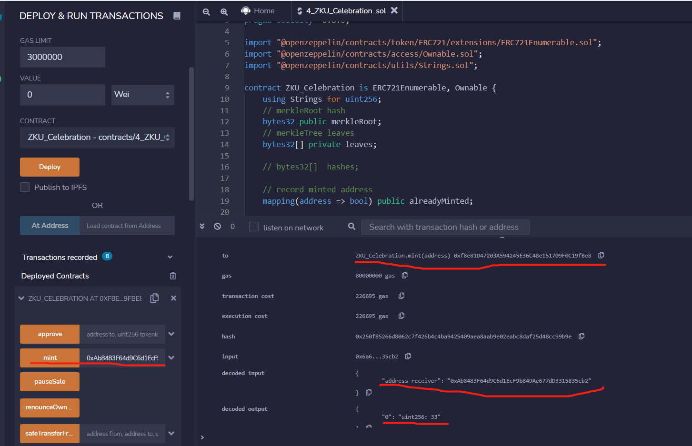

# Q1

## circom code  

```
pragma circom 2.0.0;

include "mimcsponge.circom";


template Merkle8 () {

    signal input ins[8];
    signal output out;

    component ins_L1[4];

    for(var i = 0; i < 4; i++) {
        ins_L1[i] = MiMCSponge(2, 220, 1);
        ins_L1[i].ins[0] <-- ins[2*i];
        ins_L1[i].ins[1] <-- ins[2*i+1];
        ins_L1[i].k <== 0;
    }
    component ins_L2[2];
    for(var i = 0; i < 2; i++) {
        ins_L2[i] = MiMCSponge(2, 220, 1);
        ins_L2[i].ins[0] <--  ins_L1[2*i].outs[0];
        ins_L2[i].ins[1] <--  ins_L1[2*i+1].outs[0];
        ins_L2[i].k <== 0;
    }

    component top = MiMCSponge(2, 220, 1);
    top.ins[0] <-- ins_L2[0].outs[0];
    top.ins[1] <-- ins_L2[1].outs[0];
    top.k <== 0;

    out <== top.outs[0];
    // note: if circom support loop in loop, the above code can be Refactored to be general
}

// component: Instantiate a template.
 component main = Merkle8();

```

detailed code is [here](https://github.com/myself659/zku-assignments/tree/main/1-week1/Q1).

## public.json

```
[
 "7457672556014162487472065518158328090252704233415054189820328174772177160972"
]
```


the proof and verification of public.json is as follow:


## Do we really need zero-knowledge proof for this? Can a publicly verifiable smart contract that computes Merkle root achieve the same? If so, give a scenario where Zero-Knowledge proofs like this might be useful. Are there any technologies implementing this type of proof? Elaborate in 100 words on how they work.

We do not really need zero-knowledge proof for this. Yes, a publicly verifiable smart contract that computes Merkle root achieve the same.


## As you may have noticed, compiling circuits and generating the witness is an elaborate process. Explain what each step is doing. Optionally, you may create a bash script and comment on each step in it. This script will be useful later on to quickly compile circuits.

Sorry. I don't have enough time.

# Q2

## code

```
// SPDX-License-Identifier: MIT
// pragma solidity >=0.8.0 <0.9.0;
pragma solidity ^0.8.0;

import "@openzeppelin/contracts/token/ERC721/extensions/ERC721Enumerable.sol";
import "@openzeppelin/contracts/access/Ownable.sol";
import "@openzeppelin/contracts/utils/Strings.sol";

contract ZKU_Celebration is ERC721Enumerable, Ownable {
    using Strings for uint256;
    // merkleRoot hash
    bytes32 public merkleRoot;
    // merkleTree leaves
    bytes32[] private leaves;

    // bytes32[]  hashes;

    // record minted address
    mapping(address => bool) public alreadyMinted;

    mapping(uint256 => string) public tokenNames;

    mapping(uint256 => string) public tokenDescs;

    uint256 private reserveID;
    uint256 private currentSaleID;
    uint256 public constant maxID = 128;

    string private baseURI = "zkuc_";
    bool private saleStarted = true;

    constructor() ERC721("ZKU Celebration", "ZKUC") {
        reserveID = 1; // item 1-127
        currentSaleID = 32; // item 128-1024
    }


    // override tokenURI for adding name and desc to tokenURI
    function tokenURI(uint256 tokenId) public view override returns (string memory) {
        require(
            _exists(tokenId),
            "ERC721Metadata: URI query for nonexistent token"
        );

        return
            bytes(baseURI).length > 0
                ? string(
                    abi.encodePacked(
                        baseURI,
                        tokenId.toString(),
                        getTokenName(tokenId),
                        getTokenDesc(tokenId)
                    )
                )
                : "";
    }

    // Commit the msg.sender, receiver address, tokenId, and tokenURI to a Merkle tree using the keccak256 hash function
    function updateRoot(
        address sender,
        address receiver,
        uint256 tokenId
    ) private {
        bytes32[] memory hashes = new bytes32[](128);

        // get tokenURI by tokenId
        string memory _tokenURI = tokenURI(tokenId);
        // compute leaveHash
        bytes32  leaveHash = keccak256(
            abi.encodePacked(sender, receiver, tokenId, _tokenURI)
        );
        // push leaveHash to merkletree leaves
        leaves.push(leaveHash);

        for (uint256 i = 0; i < leaves.length; i++) {
           hashes[i] = leaves[i];
        }
        // update merkle tree
        uint256 n = leaves.length;
        while(n > 1) {
            uint256 i = 0;
            uint256 j = 0;  
            if (n % 2 == 0) {
                for(; i <= n-2 ;  i += 2 ){
                    hashes[j] = keccak256(abi.encodePacked(hashes[i],hashes[i + 1]));
                    j++;
                }
                n = n / 2;
            }else {
                 for(; i <= n-3 ;  i += 2 ){
                    hashes[j] = keccak256(abi.encodePacked(hashes[i],hashes[i + 1]));
                    j++;
                }
                n = n / 2 +1;
            }


        }

        merkleRoot = hashes[0];
        delete hashes;
    }

    function mint(address receiver) public returns (uint256) {
        require(saleStarted == true, "The sale is paused");
        require(msg.sender != address(0x0), "Public address is not correct");
        require(alreadyMinted[msg.sender] == false, "Address already used");
        require(currentSaleID <= maxID, "Mint limit reached");
        uint256  tokenID = currentSaleID;
        _safeMint(receiver, tokenID);
        alreadyMinted[msg.sender] = true;
        updateRoot(msg.sender, receiver, tokenID);

        currentSaleID++;
        return tokenID;
    }

    function getTokenName(uint256 tokenID) public view returns (string memory) {
        return tokenNames[tokenID];
    }

    function setTokenName(uint256  tokenID, string memory name) public onlyOwner {

        tokenNames[tokenID] = name;
    }

    function getTokenDesc(uint256 tokenID) public view returns (string memory) {
        return tokenDescs[tokenID];
    }

    function setTokenDesc(uint256  tokenID, string memory desc) public onlyOwner {
        tokenDescs[tokenID] = desc;
    }

    function startSale() public onlyOwner {
        saleStarted = true;
    }

    function pauseSale() public onlyOwner {
        saleStarted = false;
    }
}
```


## MINT-1


<!--
253413
0x4e047ca7efdd85e5491ef93463b8127df3f48661ac25b1f064a5c691762c0a29
 -->

## MINT-2



<!--
226695
0x6eb9f8ea6f2f546fecc2008c93aeda5b97dd47c7b14184c93eddf179c2a4785c
 -->
## MINT-3


<!--
0x0e347b13a6ea4e54cd1d8838d7a576d896c65307389e80978edb2747e6055f85
 -->

## MINT-4


## MINT-8


# Q3

## 1. Summarize the key differences (in application, not in theory) between SNARKs and STARKs in 100 words.


## 2. How is the trusted setup process different between Groth16 and PLONK?

One additional imperfection of Groth 16 is that it is actually a proving system with circuit-specific common reference string. That means the proof system can only support a fixed circuit in the setup phase for the prover. That means, when the proof system is used in other different applications, we must re-run the setup phase with different parameters.

<!--
https://medium.com/qed-it/diving-into-the-snarks-setup-phase-b7660242a0d7
 -->
## 3. Give an idea of how we can apply ZK to create unique usage for NFTs.


## 4. Give a novel idea on how we can apply ZK for Dao Tooling. (Yes, we know voting is a very popular one, but what else can ZK do?)

<!--
链上资产证明。

Voting and guaranteeing fair election results.

AMMs: Novel AMM designs are possible using our technology, including dAMM, a design where liquidity is shared across multiple independent L2 solutions.

Data Management; monitoring supply chains, managing medical information, maintaining real estate records, tracking royalties in the music industry, and more.
-->

# reference

[On-boarding 10,000 Developers for ZK Products ](https://harmonyone.notion.site/harmonyone/On-boarding-10-000-Developers-for-ZK-Products-9eeb5f83a097499289ca5e9fd113f2f5)

[Assignment 1](https://zku.one/course-schedule/assignment-1-due)
