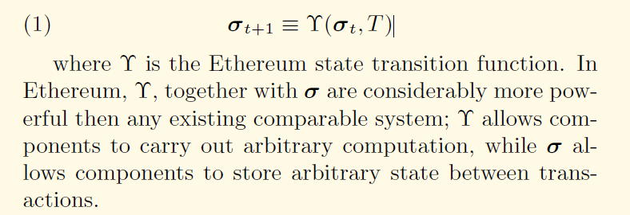
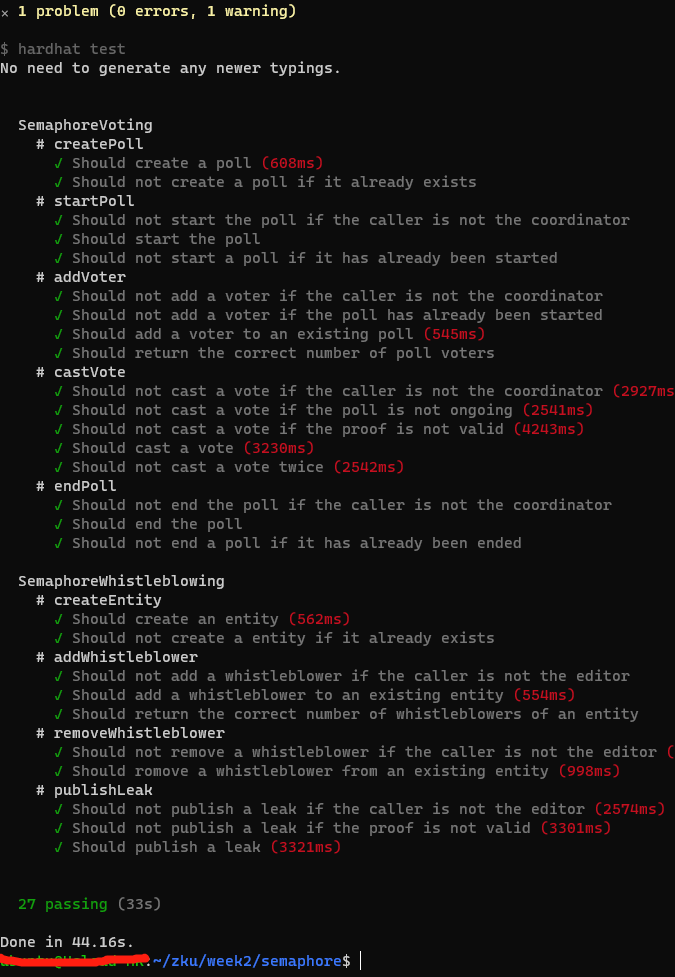
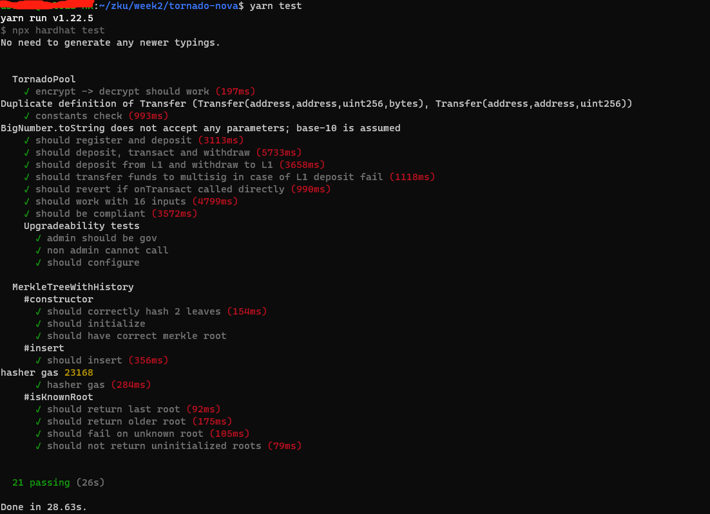

# Question 1: Privacy & ZK VMs

## 1. Explain in brief, how does the existing blockchain state transition to a new state? What is the advantage of using verification over re-execution?

<!--
what is the state？
what is the struct of state？
what does trigger state change？
the steps of state transition?
where is the state transition happened?

Mining is the process of dedicating eort (working) to
bolster one series of transactions (a block) over any other
potential competitor block
-->

the existing blockchain state transition to a new state(Taking ethereum as an example)：

Suppose the existing blockchain state is state(n) and the new state is state(n+1).

1. the execution of transactions from state(n) to state(n+1).
2. finial state(n+1).

In summary, use math to describe(From ethereum yellow paper)：


The advantage of using verification over re-execution is as follow：
- Fast verification
- Lower cost for verification
- Scalable
- Privacy

## 2. Explain in brief what is a ZK VM (virtual machine) and how it works?

ZK VM is a virtual machine that executes smart contracts in a way that is compatible with zero-knowledge-proof computation. It is the key to building an EVM-compatible ZK Rollup while preserving the battle-tested code and knowledge gained after years of working with Solidity.


<!--
https://docs.zksync.io/zkevm/#general
https://medium.com/stellar-developers-blog/zkvm-a-new-design-for-fast-confidential-smart-contracts-d1122890d9ae
 -->

### 3. Give examples of certain projects building Zk VMs (at-least 2-3 projects). Describe in brief, key differences in their VMs.

Zk VM Project list:

- Hermez zkEVM
- AppliedZKP zkEVM
- zkSync EVM

Both Hermez and  AppliedZKP zkEVM use sololution A: Direct support for the existing set of EVM opcodes, which is fully compatible with the set of Solidity opcodes.

But zkSync EVM uses sololution B: Maintaining Solidity compatibility by designing a new virtual machine that is zero-knowledge proof-friendly and adapting EVM development tools.

<!--
https://blog.matter-labs.io/zksync-2-0-hello-ethereum-ca48588de179
https://zksync.io/
https://hermez.io/
 -->
<!-- Arbitrum, Optimism -->


### 4. [Bonus] What are the advantages and disadvantages of some of the existing Zk VMs?

For sololution A, since it fully supports the existing set of EVM opcodes and uses the same compiler as EVM, it is naturally fully compatible with the existing ecosystem and development tools, and also inherits the security model of Ethereum better.
For sololution B, it is not bound by the original set of EVM opcodes, so it is more flexible to compile the code into a more zero-knowledge proof-friendly set of opcodes. It is also free from the hard and heavy work required to be compatible with all of the original set of EVM opcodes.
Overall, sololution A is more compatible and safer, but with more work; sololution B is more flexible and less work, but extra effort in adaptation is required such as porting Smart Contracts.


### 5. [Bonus] Explain in detail one of the Zk VM architectures using diagrams.

[](q1-zksyncEVM.jpg)
The above picture show the context of zkSync EVM.

[zkSync project architecture](https://github.com/matter-labs/zksync/blob/master/docs/architecture.md) is a useful guide to learn zkysnc. But I do not have enough time to dive into the code.

<!--
https://blog.matter-labs.io/zksync-2-0-hello-ethereum-ca48588de179
 -->

# Question 2. Semaphore

<!--
https://semaphore.appliedzkp.org/docs/technical-reference/circuits
https://www.youtube.com/watch?v=y5uV9eRb3-w
https://medium.com/coinmonks/to-mixers-and-beyond-presenting-semaphore-a-privacy-gadget-built-on-ethereum-4c8b00857c9b

https://weijiek.medium.com/private-voting-and-whistleblowing-in-ethereum-using-semaphore-449b376808e
 -->
## 1. What is Semaphore? Explain in brief how it works? What applications can be developed using Semaphore (mention 3-4)?

Semaphore is a zero-knowledge gadget which allows Ethereum users to prove their membership of a set which they had previously joined without revealing their original identity.


Semaphore's Application Scenarios is as follow:

1. Private voting
2. Private whistleblowing
3. Private proof of asset
4. decentralized ID
5. Zero Knowledge Lottery

<!--
https://semaphore.appliedzkp.org/docs/V1/howitworks

 -->

## 2. Clone the semaphore repo (3bce72f).

- Run the tests and add a screenshot of all the test passing.


The script for running test cases:

```
git clone https://github.com/appliedzkp/semaphore
cd semaphore
git checkout 3bce72febeba48454cb618a1f690045c04809900
yarn --frozen-lockfile
yarn compile
yarn test:prod
```

The screenshot is as follows:



- Explain code in the sempahore.circom file (including public, private inputs).


1. public input: signalHash, externalNullifier, private inputs: identityNullifier, identityTrapdoor, treeSiblings, treePathIndices...
2. poseidon(identityNullifier,identityTrapdoor) => secret
3. poseidon(secret)  => inclusionProof.leaf
4. poseidon(externalNullifier, identityNullifier) => nullifierHash
5. MerkleTreeInclusionProof(inclusionProof.leaf, treeSiblings, treePathIndices) => root
6. outputs: root(in step 5 ) and nullifierHash(in step 4)


- [Bonus] Create a frontend for the current semaphore version. You can use this as reference.

Sorry, I do not have enough time to finish it.

<!--

[Semaphore: Zero-Knowledge Signaling on Ethereum](https://docs.zkproof.org/pages/standards/accepted-workshop3/proposal-semaphore.pdf)


https://medium.com/coinmonks/to-mixers-and-beyond-presenting-semaphore-a-privacy-gadget-built-on-ethereum-4c8b00857c9b

https://github.com/appliedzkp/semaphore/commit/3bce72febeba48454cb618a1f690045c04809900

https://github.com/appliedzkp/semaphore/blob/main/.github/workflows/test.yml

git clone https://github.com/appliedzkp/semaphore
cd semaphore
git checkout 3bce72febeba48454cb618a1f690045c04809900
yarn --frozen-lockfile
yarn compile
yarn test:prod

 -->

## 3. Use Elefria protocol on the Harmony Testnet, try to generate a ZK identity and authenticate yourself as a user.

- What potential challenges are there to overcome in such an authentication system?

The potential challenges are as follows:

1.  how to handle many users's requests
2.  how to reduce latency of the requests


- [Bonus] What potential improvements can one make to simplify the Elefria authentication protocol?

Maybe we can let the user generates authToken to reduce steps and gas cost.

The Steps are as follows:

1. user generates authToken and submit zkid proof and  authToken to smart contract
2. smart contract verfied  zkid proof and store authToken
3. user send uuid and  authToken to web3/web2 platform
4. web3/web2 platform  send  authToken to  smart contract
5. smart contract respond uuid to  web3/web2 platform
6. web3/web2 platform validate uuid
7. web3/web2 platform grant access to user


<!--
https://www.elefria.com/


 -->

# Question 3. Tornado Cash

<!--
https://www.youtube.com/watch?v=z_cRicXX1jI
https://docs.google.com/presentation/d/1CbI6fiWvgwoD_1ahcSR62wD7V4TdSzkdL2RwAeMPagQ/edit
 -->

## 1. Compare and contrast the circuits and contracts in the two repositories above (or consult this article), summarize the key improvements/upgrades from tornado-trees to tornado-nova in 100 words.

<!--
https://www.youtube.com/watch?v=BaFg4NF_ZOs
https://github.com/tornadocash/tornado-trees
https://github.com/tornadocash/tornado-nova
https://tornadocash.eth.link/
https://nova.tornadocash.eth.link/
-->

The key improvements/upgrades from tornado-trees to tornado-nova are as follows:

1. Suport L2(xdai) to reduce the costs of transactions
2. Contracts will be upgradable
3. Privacy pool with internal transactions
4. Support Arbitrary amounts for deposit


## 2. Check out the tornado-trees repo

###  Take a look at the circuits/TreeUpdateArgsHasher.circom and contracts/TornadoTrees.sol. Explain the process to update the withdrawal tree (including public, private inputs to the circuit, arguments sent to the contract call, and the on-chain verification process).

<!--
compute proof.

public inputs:
root
nullifierHash

private inputs:
secret
nullifier
pathElements
pathIndices

output:

root  
nullifierHash
-->


The circuit process: TreeUpdateArgsHasher(oldRoot, newRoot, pathIndices, hashes, instances, blocks ) =>  argsHash

Because it is update tree in batch, so  need to send raw data to  verification process.
The arguments sent to the contract call are as follows:
```
  /// @dev Insert a full batch of queued withdrawals into a merkle tree
  /// @param _proof A snark proof that elements were inserted correctly
  /// @param _argsHash A hash of snark inputs
  /// @param _currentRoot Current merkle tree root
  /// @param _newRoot Updated merkle tree root
  /// @param _pathIndices Merkle path to inserted batch
  /// @param _events A batch of inserted events (leaves)
 function updateWithdrawalTree(
    bytes calldata _proof,
    bytes32 _argsHash,
    bytes32 _currentRoot,
    bytes32 _newRoot,
    uint32 _pathIndices,
    TreeLeaf[CHUNK_SIZE] calldata _events
  ) public

```

The the on-chain verification process is described in the code note:

```
function updateWithdrawalTree(
        bytes calldata _proof,
        bytes32 _argsHash,
        bytes32 _currentRoot,
        bytes32 _newRoot,
        uint32 _pathIndices,
        TreeLeaf[CHUNK_SIZE] calldata _events
    ) public {
        uint256 offset = lastProcessedWithdrawalLeaf;
        require(_currentRoot == withdrawalRoot, "Proposed withdrawal root is invalid");
        require(_pathIndices == offset >> CHUNK_TREE_HEIGHT, "Incorrect withdrawal insert index");

        // pepare data for sha256
        bytes memory data = new bytes(BYTES_SIZE);
        assembly {
            mstore(add(data, 0x44), _pathIndices)
            mstore(add(data, 0x40), _newRoot)
            mstore(add(data, 0x20), _currentRoot)
        }
        for (uint256 i = 0; i < CHUNK_SIZE; i++) {
            (bytes32 hash, address instance, uint32 blockNumber) = (_events[i].hash, _events[i].instance, _events[i].block);
            bytes32 leafHash = keccak256(abi.encode(instance, hash, blockNumber));

            bytes32 withdrawal = offset + i >= withdrawalsV1Length
                ? withdrawals[offset + i]
                : tornadoTreesV1.withdrawals(offset + i);
            // check leafhash
            require(leafHash == withdrawal, "Incorrect withdrawal");
            // push blockNumber, instance, hash to  data Array
            assembly {
                let itemOffset := add(data, mul(ITEM_SIZE, i))
                mstore(add(itemOffset, 0x7c), blockNumber)
                mstore(add(itemOffset, 0x78), instance)
                mstore(add(itemOffset, 0x64), hash)
            }
            if (offset + i >= withdrawalsV1Length) {
                delete withdrawals[offset + i];
            } else {
                emit WithdrawalData(instance, hash, blockNumber, offset + i);
            }
        }
        // compute argsHash by sha256
        uint256 argsHash = uint256(sha256(data)) % SNARK_FIELD;
        // check computed argsHash and  _argsHash
        require(argsHash == uint256(_argsHash), "Invalid args hash");
        // verify merkle proof
        require(treeUpdateVerifier.verifyProof(_proof, [argsHash]), "Invalid withdrawal tree update proof");
        // verifyProof ok, update previousWithdrawalRoot
        previousWithdrawalRoot = _currentRoot;
        // verifyProof ok, update withdrawalRoot
        withdrawalRoot = _newRoot;
        // verifyProof ok, update  lastProcessedWithdrawalLeaf
        lastProcessedWithdrawalLeaf = offset + CHUNK_SIZE;
    }
```


###  Why do you think we use the SHA256 hash here instead of the Poseidon hash used elsewhere?

In circuits/TreeUpdateArgsHasher.circom, we use the SHA256 hash  to update ARgsHasher. The code is as follows:

```
template TreeUpdateArgsHasher(nLeaves) {
    signal input oldRoot;
    signal input newRoot;
    signal input pathIndices;
    signal input instances[nLeaves];
    signal input hashes[nLeaves];
    signal input blocks[nLeaves];
    signal output out;

    var header = 256 + 256 + 32;
    var bitsPerLeaf = 256 + 160 + 32;
    // using Sha256 to compute argsHash for verification in updateWithdrawalTree
    component hasher = Sha256(header + nLeaves * bitsPerLeaf);
    ...
}
```

Because the output of TreeUpdateArgsHasher is used for merkle proof in the solidity(solidity do not support Poseidon hash). the related code is as follows:

```
// use sha256 to process data(_currentRoot+_newRoot+_pathIndices)
uint256 argsHash = uint256(sha256(data)) % SNARK_FIELD;
require(argsHash == uint256(_argsHash), "Invalid args hash");
require(treeUpdateVerifier.verifyProof(_proof, [argsHash]), "Invalid withdrawal tree update proof");
```


<!--

[POSEIDON: A New Hash Function for Zero-Knowledge Proof Systems](https://eprint.iacr.org/2019/458.pdf)
 -->
<!--
npm install --global yarn
git clone git@github.com:tornadocash/tornado-nova.git
cd tornado-nova
yarn
yarn build
yarn test
 -->

## 3. Clone/fork the tornado-nova repo

### 1. Run the tests and add a screenshot of all the tests passing.



### 2. Add a script named custom.test.js under test/ and write a test for all of the followings in a single it function

- estimate and print gas needed to insert a pair of leaves to MerkleTreeWithHistory
- deposit 0.08 ETH in L1
- withdraw 0.05 ETH in L2
- assert recipient, omniBridge, and tornadoPool balances are correct

The full code is [here](https://github.com/myself659/tornado-nova/commit/083a2941d796b97b2a468d1b48445e1ca2c7bf78).

![q3-addtestpass.png]

## 4.[Bonus] Read Proposal #11 of Tornado.cash governance, what is the purpose of the newly deployed L1Unwrapper contract?

The purpose is to allow Tornado Cash Nova to continue running, even without the xDai team intervention.

<!--
https://torn.community/t/proposal-upgrade-nova-implementation/2172
https://etherscan.io/address/0x3F615bA21Bc6Cc5D4a6D798c5950cc5c42937fbd#code
 -->

# Question 4. Thinking In ZK


## 1. If you have a chance to meet with the people who built Tornado Cash & Semaphore, what questions would you ask them about their protocols?

questions for Tornado Cash:

1. can harmony be the L2 for Tornado Cash like xDai? and what will need to do for it ?
2. any plan to deploy Tornado Cash  on harmony?
3. Tornado Cash is aim to shield transaction, is there any plan to Expand the scope of Tornado Cash's application?


questions for Semaphore:

1.  How to abstract protocols to meet many kinds of applications requirements?


## 2. [Bonus] Regarding writing and maintaining circuits for each dapp separately, what are your thoughts about using just one circuit for all dapps? Is that even possible?  What is likely to be a standard in the future for developing Zk dapps?

In theory using just one circuit for all dapps is possible , just like as an computer OS for many computer applicaion. But zk dapps often require much compute, use specific circuit for the specific dapp maybe is a better option because it is easy to develop, customized.

The standards in the future for developing Zk dapps:

1. the standard zk VM to supply environment for zk dapps
2. standard tools and standard libs for developping zk dapps

<!--
https://hackmd.io/@HtwXZr-PTFCniCs7fWFSmQ/r1M1EMAuL
-->


# reference

1. [zku.ONE – 2022 Mar-April Syllabus / Course Schedule](https://zku.one/course-schedule)
2. [Assignment 2](https://zku.one/course-schedule/assignment-2)
3. [Final Projects by ZKU Genesis Graduates](https://zku.one/final-project-submissions)
