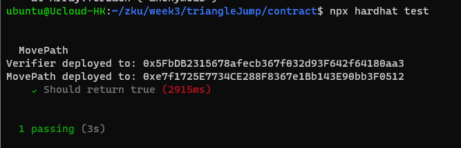
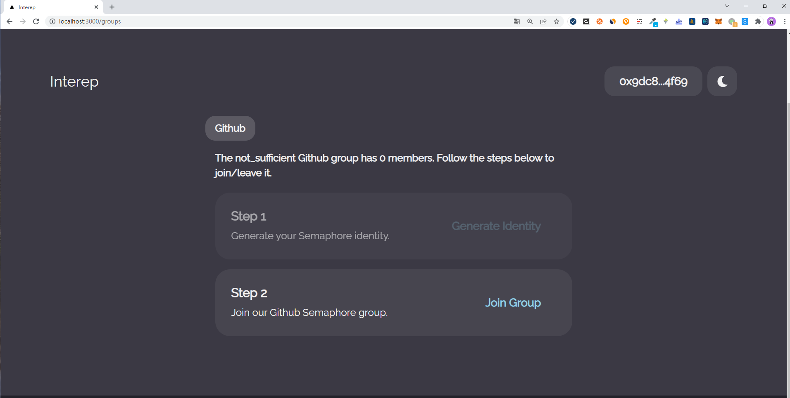
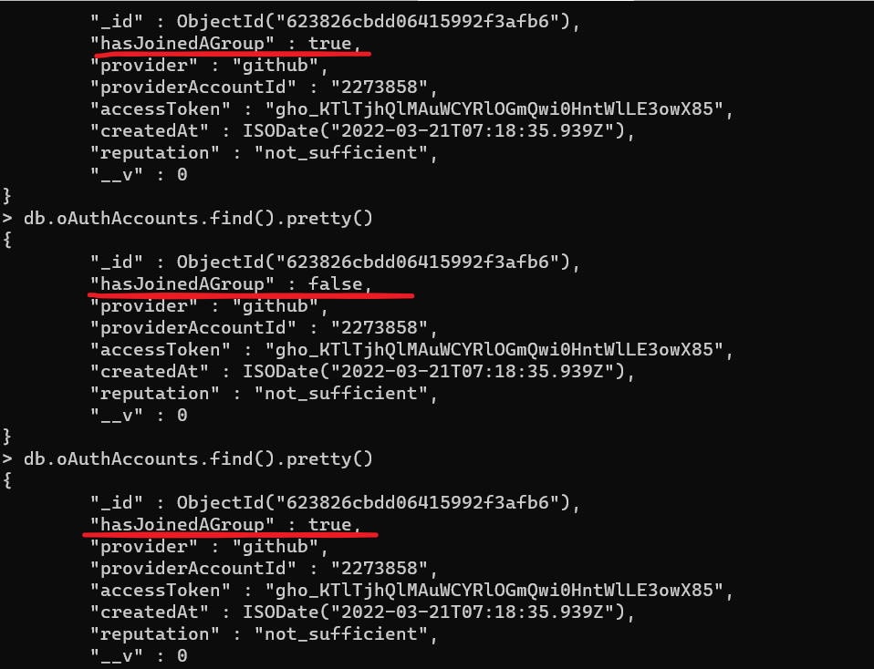
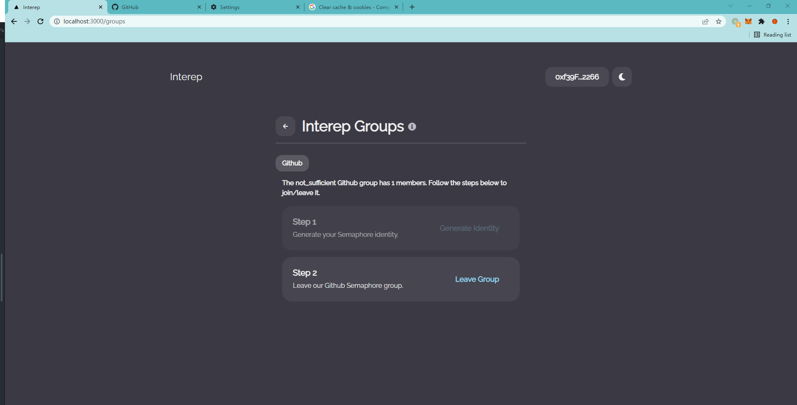
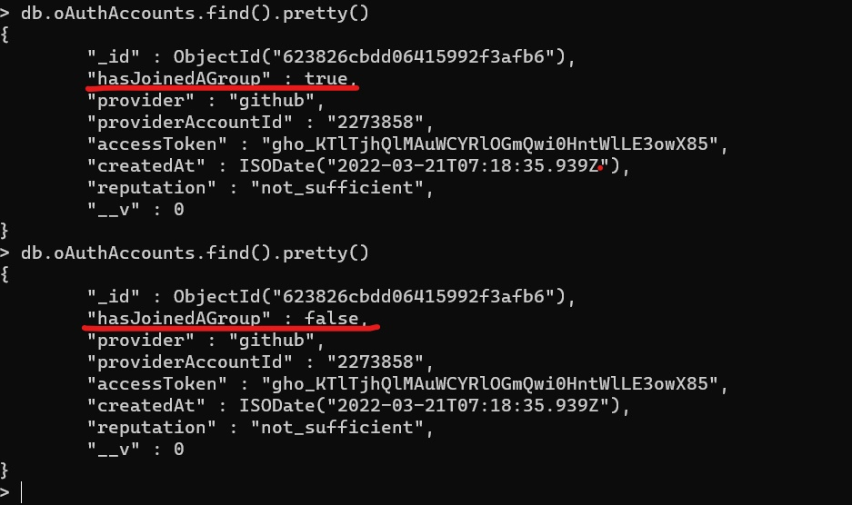
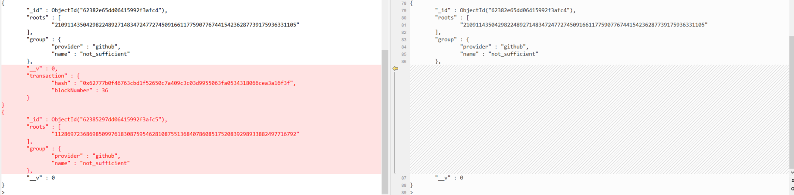
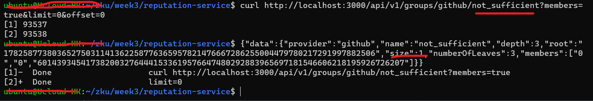
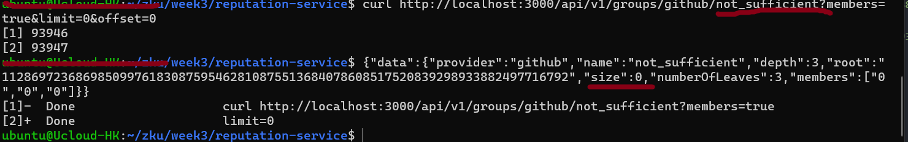

# Question 1: Dark Forest

<!--
https://www.xdaichain.com/about-gc/project-spotlights/dark-forest
https://blog.zkga.me/announcing-darkforest
https://mirror.xyz/cryptodesigner.eth/3mffedGJy1UxhQWaNUt6dLFUhCrMgaleoVXkyivV5Ik
https://omarmezenner.mirror.xyz/gFCfCVwTfUU91SDXeROEaDQe4984nbFBIgv9QSY0r1U
https://blog.zkga.me/df-init-circuit VIM
https://hackmd.io/@n2eVNsYdRe6KIM4PhI_2AQ/SJJ8QdxuB

 -->
 >In DarkForest the move circuit allows a player to hop from one planet to another.

 >Consider a hypothetical extension of DarkForest with an additional ‘energy’ parameter. If the energy of a player is 10, then the player can only hop to a planet at most 10 units away. The energy will be regenerated when a new planet is reached.

 >Consider a hypothetical move called the ‘triangle jump’, a player hops from planet A to B then to C and returns to A all in one move, such that A, B, and C lie on a triangle.


## 1. Write a Circom circuit that verifies this move. The coordinates of A, B, and C are private inputs. You may need to use basic geometry to ascertain that the move lies on a triangle. Also, verify that the move distances (A → B and B → C) are within the energy bounds.

Code is [here](https://github.com/myself659/triangleJump/blob/main/circuits/move/circuit.circom)

<!--

circom circuit.circom --r1cs --wasm --sym --c
node generate_witness.js circuit.wasm input.json witness.wtns

snarkjs powersoftau new bn128 13 pot13_0000.ptau -v
snarkjs powersoftau contribute pot13_0000.ptau pot13_0001.ptau --name="First contribution" -v
snarkjs powersoftau prepare phase2 pot13_0001.ptau pot13_final.ptau -v

snarkjs groth16 setup circuit.r1cs pot13_final.ptau circuit_0000.zkey
snarkjs zkey contribute circuit_0000.zkey circuit_0001.zkey --name="1st Contributor Name" -v

snarkjs zkey export verificationkey circuit_0001.zkey verification_key.json

snarkjs groth16 prove circuit_0001.zkey witness.wtns proof.json public.json

snarkjs groth16 verify verification_key.json public.json proof.json

snarkjs zkey export solidityverifier circuit_0001.zkey verifier.sol

 -->

## 2. [Bonus] Make a Solidity contract and a verifier that accepts a snark proof and updates the location state of players stored in the contract.

[contract](https://github.com/myself659/triangleJump/tree/main/contract)




<!-- ```
["0x2b56d1577f6ea59e156056d9800d551851fa9c7b6d2a66a8edf59b1eeaee478d", "0x30220d0d1bdc5d90407d3663360809c254e6228c47defd13dbc8f4a98a71e5d6"],[["0x026bc113a6d0620c2a928df4ec2f4a2080dd1f7c9dce85ce6ed7c460669bdd7c", "0x24237c6531c24ab6c4ad44e13912235e3a107c8dcbb18760d43a815f1e7341f1"],["0x2f38d7de27609bdc8388811048e1dcaa7111fa00039c9ffa02085a590c2d7d40", "0x26243c6f0a9a1e88bcc3e5af85b7ddd2b7c25809123ca17aac954f8547bd9b23"]],["0x1b269ab5ed66a9c807069613775a57ffd1d4dd4e45e4a22d6e0e77306d5c1c2d", "0x1a47f60b19b9ec14de18a3576f04dc65b6ff5d5fc8a0fc4569b2af90c4719799"],["0x007bad9fe7f829e399815d21804f8e7922aa3251fec01fe273f4929199cda5e2","0x21dfcd4db526f94871f53b3ec272c23a6e557750a56e4e88ce98a2e8c993a51f"]
``` -->

# Question 2: Fairness in card games

<!--
https://medium.com/coinmonks/zk-poker-a-simple-zk-snark-circuit-8ec8d0c5ee52
https://blog.zkga.me/announcing-darkforest
 -->
##  1. Card commitment - In DarkForest, players commit to a location by submitting a location hash. It is hard to brute force a location hash since there can be so many possible coordinates.

>In a card game, how can a player commit to a card without revealing what the card is? A naive protocol would be to map all cards to a number between 0 and 51 and then hash this number to get a commitment. This won’t actually work as one could easily brute force the 52 hashes.

>To prevent players from changing the card we need to store some commitment on-chain. How would you design this commitment? Assume each player has a single card that needs to be kept secret.  Modify the naive protocol so that brute force doesn’t work.

when create commitment, just add a password for a card. this is same to add salt when hash password.

The code is [here](https://github.com/myself659/cardCommitment/blob/main/circuits/cardHash/circuit.circom).


## 2. Now assume that the player needs to pick another card from the same suite. Design a circuit that can prove that the newly picked card is in the same suite as the previous one. Can the previous state be spoofed? If so, what mechanism is needed in the contracts to verify this?

>Design a contract, necessary circuits, and verifiers to achieve this. You may need to come up with an appropriate representation of cards as integers such that the above operations can be done easily.

The code is [here](https://github.com/myself659/cardSuite).

<!-- ## 3. [Bonus] How can a player reveal that it is a particular card (Say ace) without revealing which suit it belongs to (ace of diamonds etc.) -->


# Question 3: MACI and VDF

## 1. What problems in voting does MACI not solve? What are some potential solutions?

<!--
https://github.com/appliedzkp/maci/tree/v1
https://medium.com/privacy-scaling-explorations/release-announcement-maci-1-0-c032bddd2157
https://ethresear.ch/t/maci-anonymization-using-rerandomizable-encryption/7054
https://blog.clr.fund/trusted-setup-completed/
https://ethresear.ch/t/minimal-anti-collusion-infrastructure/5413
https://medium.com/privacy-scaling-explorations/a-technical-introduction-to-maci-1-0-db95c3a9439a
https://talk.harmony.one/t/unbiasable-randomness-generation-with-vrf-and-vdf/52
https://betterprogramming.pub/how-to-generate-truly-random-numbers-in-solidity-and-blockchain-9ced6472dbdf
 -->

The problems in voting which MACI does not solve:

1. No fully Anonymisation. In MACI,While all votes are encrypted, the coordinator is able to decrypt and read them. We can use rerandomizable encryption to process votes.
2. No an official trusted setup. Every application needs to do a different trusted setup with a specific set of circuit parameters.We can build  general circle lib for trusted setup.


## 2. How can a pseudorandom dice roll be simulated using just Solidity?

### 1. What are the issues with this approach?

solution A: using blocktime for pseudorandom dice roll.

```
    function randomNum() internal view returns (uint256) {
        return (uint256(blockhash(block.timestamp)) % 6) + 1;
    }
```

The issues:

1. according to the blocktime, Attacker can predict the dice roll
2. Miners can manipulate the blocktime


### 2. How would you design a multi party system that performs a dice roll?

solution B:

```
//SPDX-License-Identifier: GPL-3.0
pragma solidity ^0.8.4;

contract diceRoll {
    mapping(address => bool) private submitRecords;
    uint256[] private nums;
    uint256 minSubmit = 5;
    uint256 currentSubmit = 0;

    function submitRandom(uint256 num) public {
        require(!submitRecords[msg.sender]);
        currentSubmit++;
        nums.push(num);
    }

    function roll() public view returns (uint256) {
        require(currentSubmit >= minSubmit);
        uint256 sum = 0;
        for (uint256 i = 0; i < currentSubmit; i++) {
            sum += uint256(blockhash(nums[i]));
        }
        sum += uint256(blockhash(block.timestamp));
        return (sum % 6) + 1;
    }
}
```


### 3. Compare both techniques and explain which one is fairer and why.

solution B is fair. In solution B, the result of roll is depend on some inputs:

1. more than 5 random numbers from different address
2. block.timestamp

The more depends on , the more difficult to predict and manipulate

### 4. Show how the multi party system is still vulnerable to manipulation by malicious parties and then elaborate on the use of VDF’s in solving this.

In solution B, if Users share random numbers with miners, so the miners will get all information to manipulate the result of roll.
So, we need VDF to fairly generate the random number. The random number generated by VDF can not be predicted before the deadline, it is true random numbers.

The code is as follows:

```
pragma solidity 0.6.2;

import "https://raw.githubusercontent.com/smartcontractkit/chainlink/develop/evm-contracts/src/v0.6/VRFConsumerBase.sol";

contract VRFTestnetD20 is VRFConsumerBase {
    using SafeMath_Chainlink for uint;

    uint256[] public d20Results;

    bytes32 internal keyHash;
    uint256 internal fee;

    /**
     * @notice Constructor inherits VRFConsumerBase
     * @dev Ropsten deployment params:
     * @dev   _vrfCoordinator: 0xf720CF1B963e0e7bE9F58fd471EFa67e7bF00cfb
     * @dev   _link:           0x20fE562d797A42Dcb3399062AE9546cd06f63280
     */
    constructor(address _vrfCoordinator, address _link)
        VRFConsumerBase(_vrfCoordinator, _link) public
    {
        vrfCoordinator = _vrfCoordinator;
        LINK = LinkTokenInterface(_link);
        keyHash = 0xced103054e349b8dfb51352f0f8fa9b5d20dde3d06f9f43cb2b85bc64b238205;
        fee = 10 ** 18;
    }

    /**
     * @notice Requests randomness from a user-provided seed
     * @dev This is only an example implementation and not necessarily suitable for mainnet.
     * @dev You must review your implementation details with extreme care.
     */
    function rollDice(uint256 userProvidedSeed) public returns (bytes32 requestId) {
        require(LINK.balanceOf(address(this)) > fee, "Not enough LINK - fill contract with faucet");
        bytes32 _requestId = requestRandomness(keyHash, fee, userProvidedSeed);
        return _requestId;
    }

    /**
     * @notice Modifier to only allow updates by the VRFCoordinator contract
     */
    modifier onlyVRFCoordinator {
        require(msg.sender == vrfCoordinator, 'Fulfillment only allowed by VRFCoordinator');
        _;
    }

    /**
     * @notice Callback function used by VRF Coordinator
     * @dev Important! Add a modifier to only allow this function to be called by the VRFCoordinator
     * @dev This is where you do something with randomness!
     * @dev The VRF Coordinator will only send this function verified responses.
     * @dev The VRF Coordinator will not pass randomness that could not be verified.
     */
    function fulfillRandomness(bytes32 requestId, uint256 randomness) external override onlyVRFCoordinator {
        uint256 d20Result = randomness.mod(20).add(1);
        d20Results.push(d20Result);
    }

    /**
     * @notice Convenience function to show the latest roll
     */
    function latestRoll() public view returns (uint256 d20result) {
        return d20Results[d20Results.length - 1];
    }
}
```

<!--
## 3. [Bonus] How would two players pick a random and mutually exclusive subsets of a set? For instance, in a poker game, how would two players decide on a hand through the exchange of messages on a blockchain?
-->

<!--
Basically q3.3 is asking abt the scenario that we want to play real poker on chain (or big 2 any card games that is multiplayer really) how do we keep each hand private but also not colliding? It’s a bonus question for a reason.
 -->

# Question 4: InterRep

<!--
https://www.youtube.com/watch?v=QlQfUNLWB0Q
https://docs.interep.link/
https://jaygraber.medium.com/introducing-interrep-255d3f56682

 -->

## 1. How does InterRep use Semaphore in their implementation? Explain why InterRep still needs a centralized server.

InterRep uses Semaphore:

1.  users use Semaphore to re-generate their Semaphore identity
2.  users use Semaphore identity to create Semaphore proofs to hide their private information
3.  with Semaphore proofs, users can use use the anonymous user signals


The reasons for why InterRep still needs a centralized server:

1. a centralized server is need to bridge the web2.0 account to InterRep
2. a centralized server is need to maintain group's data and state such as joining/leaving group


## 2. Clone the InterRep repos: contracts and reputation-service. Follow the instructions on the Github repos to start the development environment. Try to join one of the groups, and then leave the group. Explain what happens to the Merkle Tree in the MongoDB instance when you decide to leave a group.

<!--
https://github.com/interep-project/contracts
https://github.com/interep-project/reputation-service
https://medium.com/privacy-scaling-explorations/unirep-a-private-and-non-repudiable-reputation-system-7fb5c6478549
 -->

join group:





leave group:





when a number leaves from a group, The Merkle Tree delete the hash of the number from the group's Merkle tree and update the the root of Merkle Tree.  the change is as follows：



 [InterRep contracts address in Kovan Testnet Network](https://kovan.etherscan.io/address/0xaafc8878a5b2e6b2b5c3fc2785e0c586636f87a2#code)

## 3. Use the public API (instead of calling the Kovan testnet, call your localhost) to query the status of your own identityCommitment in any of the social groups supported by InterRep before and after you leave the group. Take the screenshots of the responses and paste them to your assignment submission PDF.

one user join the group:




one user leave the group:



<!--
https://www.digitalocean.com/community/tutorials/how-to-install-mongodb-on-ubuntu-20-04
https://www.digitalocean.com/community/tutorials/how-to-install-mongodb-on-ubuntu-18-04-source
https://docs.interep.link/api
https://github.com/settings/applications/
https://github.com/settings/developers
21-03-2022 14:44:14:4414 error: The zero hashes have not yet been created
 -->


<!-- ## 4. [Bonus] Suggest a viable solution to make InterRep completely decentralized. -->


# Question 5: Thinking in ZK


## 1. If you have a chance to meet with the people who built DarkForest and InterRep, what questions would you ask them about their protocols?

Questions for InterRep：

1.  Which is better to use for reputation, the account from web2  or the native account from web3 such as [debank Web3 Social Ranking](https://debank.com/ranking)?
2.  How to measure a user's reputation in your protocol?


# reference

1. [Assignment 3](https://zku.one/course-schedule/assignment-3)
2. [zkDAO – Succinct, Private, Fair](https://open.harmony.one/zkdao-succinct-private-fair)
3. [zku.ONE – 2022 Mar-April Syllabus / Course Schedule](https://zku.one/course-schedule)
