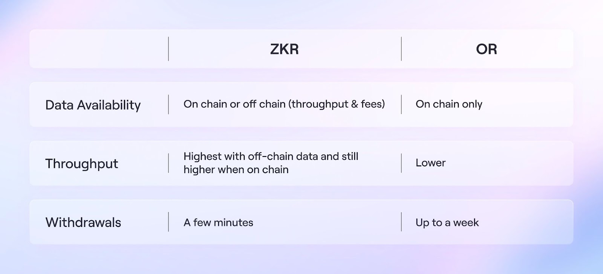

## Q0 Which stream do you choose (answer with A or B)?

stream A.

## Q1 Scaling the future

In the blockchain there is a well known scalability trilemma. We can’t have decentralized, secure and scalable L1 blockchain. Many blockchains tend to be secure and decentralized, but they lack scalability.

### 1. Based on the above, a number of solutions have been proposed to solve this trilemma. Briefly describe the different scalability solutions and write pros and cons of each approach. What was the biggest problem with the Plasma approach?

<!--
https://medium.com/coinmonks/easy-to-understand-ethereum-layer-2-scaling-solutions-channels-vs-plasma-vs-rollups-1dc1d4e9cb52
https://morioh.com/p/a72fdaa98d16
https://www.abmedia.io/chainnews-introducing-plasma-and-rollup
https://blog.matter-labs.io/optimistic-vs-zk-rollup-deep-dive-ea141e71e075
https://vitalik.ca/general/2021/01/05/rollup.html VIM
https://mobile.twitter.com/mt_1466/status/1498365222356140035
 -->

Take L2 as an example, there are 4 L2 solutions to try to solve this trilemma.

1. ZK-Rollups: Proposed by Ethereum researchers, all computation happens off-chain, stored on-chain, and the plaintext data is sent to the on-chain contract via calldata, reducing storage costs. The zero-knowledge proof guarantees the correctness of the off-chain computation. This scheme can greatly increase the TPS and reduce gas fees.

2. Optimistic Rollups: Optimistic Rollups and ZK-Rollups are in the same column because they share one common feature — the plaintext data is sent to the on-chain contract via calldata; the difference is that Optimistic Rollups use fraud-proof to somewhat achieve the accuracy of the off-chain computation. If anyone discovers that one batch had an incorrect post-state root, they can publish a proof to chain, proving that the batch was computed incorrectly. The contract verifies the proof and reverts that batch and all batches after it. Compared to ZK-Rollups, Optimistic Rollups have weaker security assumptions and take about one week when withdrawing from layer2 to layer1.

3. Validium: Proposed by StarkWare, in Validium, computation is off-chain. The zero-knowledge proof algorithm guarantees the correctness of the computation. The verification is completed on-chain, and the final state is stored on-chain. The transaction data is also stored off-chain for better scalability, and the credible Data Availability Committee(DAC) provides proof of data availability. Compared with ZK-Rollups and Optimistic Rollups, Validium loses a certain amount of data availability, but it provides better scalability. Therefore, this solution may be more favored in some applications scenario.

4. Plasma: Plasma was the earliest compared to the other three solutions, with computation off-chain, storage on-chain, and transaction data stored off-chain. Users can initiate fraud proofs to prove the operator’s fraudulent behavior, thereby obtaining rewards and slashing the fraudulent operator.


the biggest problems with the Plasma approach:

1. Because plasma keeps all the transaction data and computation off-chain, Compared with rollup, plasma is less secure.
2. Plasma is not general-purpose, plasma can not run EVM dapps.


### 2. One of the solutions that has been gaining a lot of traction lately is zkRollups. With the use of a diagram explain the key features of zkRollups. Argue for or against this solution highlighting its benefits or shortcomings with respect to other solutions proposed or in use.

<!--
https://blog.matter-labs.io/optimistic-vs-zk-rollup-deep-dive-ea141e71e075
 -->
benefits of zkRollups:

1. Compared with other L2 solutions, zkRollups are the most secure
2. fast to validate txs in L2s so reduce withdrawal times from 1–2 weeks to a few minutes
3. With zkSync 2.0, the L2 state will be divided into two distinct options: a zk-Rollup with on-chain data availability, and the zkPorter option with off-chain data availability

shortcomings of zkRollups:

1. zk-Rollup is difficult to achieve EVM compatibility when compared to Optimistic rollup
2. zk-Rollup need trust setup
3. ZK Rollup is more sophisticated than Optimistic Rollups



### 3. Ethereum is a state machine that moves forward with each new block. At any instance, it provides a complete state of Ethereum consisting of the data related to all accounts and smart contracts running on the EVM. The state of Ethereum modifies whenever a transaction is added to the block by changing the balances of accounts. Based on the massive adoption of Ethereum across the globe, this state has become a bottleneck for validators trying to sync with the network as well as validate transactions. Briefly describe the concept of stateless client, and how they help resolve this issue? Explain how Zero-Knowledge improves on the concept of stateless client?

<!--
https://docs.ethhub.io/ethereum-roadmap/ethereum-2.0/stateless-clients/
https://notes.ethereum.org/@vbuterin/verkle_and_state_expiry_proposal
https://ethresear.ch/t/complete-revamp-of-the-stateless-ethereum-roadmap/8592
https://ethresear.ch/t/the-stateless-client-concept/172
https://antonassocareer.medium.com/%E6%B7%BA%E8%AB%87-rsa-accumulator-%E8%88%87stateless-client-a75f00ad388e

The “goal” of “Stateless Ethereum” is to modify the protocol such that we can have stateless clients which do not store the state and instead, use witnesses to execute and verify new blocks.
 -->
stateless client is a light node. it does not need to store the complete state of Ethereum consisting of the data related to all accounts and smart contracts running on the EVM, but it is can verifiy state e.g. verifiy transaction.

Instead of storing the complete state of Ethereum, the stateless client does not store any state. It just uses witness data and input/output states to verify the proof of state. It is stateless, meaning that doesn't need to maintain state and thus avoid the  disk io's bottleneck.

From state(n) to state(n+1),using zk-STARKs/SNARKs to generate proof for execution of transactions. The stateless client verifies the transactions justs verifies input state(state(n)), output state(n+1), and proof.


## Q2 Roll the TX up

### 1. [Infrastructure Track only] Review the RollupNC source code in the learning resources focusing on the contract and circuit and explain the below functions (Feel free to comment inline)

- UpdateState (Contract)
- Deposit (Contract)
- Withdraw (Contract)
- UpdateStateVerifier (Circuit)

Note: *comments start with `///`*.

#### UpdateState (Contract)


```
function updateState(
         /// a:  proof parameter  which can generated by snarkjs generatecall
        uint[2] memory a,
        /// b:  proof parameter which can generated by snarkjs generatecall
        uint[2][2] memory b,
        /// c: proof parameter which can generated by snarkjs generatecall
        uint[2] memory c,
        /// input[3]: correspond to newRoot, txRoot, oldRoot
        uint[3] memory input
    ) public onlyCoordinator {
    /// check currentRoot
    require(currentRoot == input[2], "input does not match current root");
    //validate proof
    require(update_verifyProof(a,b,c,input),
    "SNARK proof is invalid");
    // update merkle root
    currentRoot = input[0];
    /// updateNumber is same to nonce
    updateNumber++;
    /// updates the map for txRoot => update idx
    updates[input[1]] = updateNumber;
    emit UpdatedState(input[0], input[1], input[2]); //newRoot, txRoot, oldRoot
}

```

#### Deposit (Contract)

```
    // user tries to deposit ERC20 tokens
    function deposit(
      /// deposit user's public key
        uint[2] memory pubkey,
      /// deposit amount
        uint amount,
      /// tokenType
        uint tokenType
    ) public payable {
      if ( tokenType == 0 ) {
           require(
			   msg.sender == coordinator,
			   "tokenType 0 is reserved for coordinator");
           require(
			   amount == 0 && msg.value == 0,
			   "tokenType 0 does not have real value");
        } else if ( tokenType == 1 ) {
           require(
			   msg.value > 0 && msg.value >= amount,
			   "msg.value must at least equal stated amount in wei");
        } else if ( tokenType > 1 ) {
            require(
				amount > 0,
				"token deposit must be greater than 0");
            address tokenContractAddress = tokenRegistry.registeredTokens(tokenType);
            tokenContract = IERC20(tokenContractAddress);
            require(
                tokenContract.transferFrom(msg.sender, address(this), amount),
                "token transfer not approved"
            );
        }
        /// prepare raw deposit information
        uint[] memory depositArray = new uint[](5);
        depositArray[0] = pubkey[0];
        depositArray[1] = pubkey[1];
        depositArray[2] = amount;
        depositArray[3] = 0;
        depositArray[4] = tokenType;
        /// hashing raw deposit information
        uint depositHash = mimcMerkle.hashMiMC(
            depositArray
        );
        /// add depositHash to pendingDeposits
        pendingDeposits.push(depositHash);
        emit RequestDeposit(pubkey, amount, tokenType);
        queueNumber++;
        /// compute the merkle hash of pendingDeposits
        uint tmpDepositSubtreeHeight = 0;
        uint tmp = queueNumber;
        while(tmp % 2 == 0){
            uint[] memory array = new uint[](2);
            array[0] = pendingDeposits[pendingDeposits.length - 2];
            array[1] = pendingDeposits[pendingDeposits.length - 1];
            pendingDeposits[pendingDeposits.length - 2] = mimcMerkle.hashMiMC(
                array
            );
            removeDeposit(pendingDeposits.length - 1);
            tmp = tmp / 2;
            tmpDepositSubtreeHeight++;
        }
        /// adjust the merkle tree's height
        if (tmpDepositSubtreeHeight > depositSubtreeHeight){
            depositSubtreeHeight = tmpDepositSubtreeHeight;
        }
    }

```


#### Withdraw (Contract)

```
    function withdraw(
        /// withdraw info
        uint[9] memory txInfo, //[pubkeyX, pubkeyY, index, toX ,toY, nonce, amount, token_type_from, txRoot]
        /// the transaction's merkle path indices root of the merkle tree
        uint[] memory position,
        /// transaction's merkle pathnode hash
        uint[] memory proof,
        /// recipent address
        address payable recipient,
        /// zk-SNARKs proof parameter
        uint[2] memory a,
        /// zk-SNARKs proof parameter
        uint[2][2] memory b,
        /// zk-SNARKs proof parameter
        uint[2] memory c
    ) public{
        require(txInfo[7] > 0, "invalid tokenType");
        require(updates[txInfo[8]] > 0, "txRoot does not exist");
        uint[] memory txArray = new uint[](8);
        for (uint i = 0; i < 8; i++){
            txArray[i] = txInfo[i];
        }
        /// get tx leaf node
        uint txLeaf = mimcMerkle.hashMiMC(txArray);
        /// get tx leaf node's merkle root's hash to  check the leaf node is in the merkle tree
        require(txInfo[8] == mimcMerkle.getRootFromProof(
            txLeaf, position, proof),
            "transaction does not exist in specified transactions root"
        );

        // message is hash of nonce and recipient address
        uint[] memory msgArray = new uint[](2);
        msgArray[0] = txInfo[5];
        msgArray[1] = uint(recipient);
        /// verifyProof with proof, pubkey, nonce, recipient
        require(withdraw_verifyProof(
            a, b, c,
            [txInfo[0], txInfo[1], mimcMerkle.hashMiMC(msgArray)]
            ),
            "eddsa signature is not valid");

        // transfer token on tokenContract
        if (txInfo[7] == 1){
            // ETH
            recipient.transfer(txInfo[6]);
        } else {
            // ERC20
            address tokenContractAddress = tokenRegistry.registeredTokens(txInfo[7]);
            tokenContract = IERC20(tokenContractAddress);
            require(
                tokenContract.transfer(recipient, txInfo[6]),
                "transfer failed"
            );
        }

        emit Withdraw(txInfo, recipient);
    }

```

#### UpdateStateVerifier (Circuit)

```
template Main(n,m) {
// n is depth of balance tree
// m is depth of transactions tree
// for each proof, update 2**m transactions

    // Merkle root of transactions tree
    signal input txRoot; /// public input

    // Merkle proof for transaction in tx tree
    signal private input paths2txRoot[2**m, m];

    // binary vector indicating whether node in tx proof is left or right
    signal private input paths2txRootPos[2**m, m];

    // Merkle root of old balance tree
    signal input currentState; /// public input

    // intermediate roots (two for each tx), final element is last.
    signal private input intermediateRoots[2**(m+1)+1];

    // Merkle proof for sender account in balance tree
    signal private input paths2rootFrom[2**m, n];

    // binary vector indicating whether node in balance proof for sender account
    // is left or right
    signal private input paths2rootFromPos[2**m, n];

    // Merkle proof for receiver account in balance tree
    signal private input paths2rootTo[2**m, n];

    // binary vector indicating whether node in balance proof for receiver account
    // is left or right
    signal private input paths2rootToPos[2**m, n];

    // tx info, 10 fields
    signal private input fromX[2**m]; //sender address x coordinate
    signal private input fromY[2**m]; //sender address y coordinate
    signal private input fromIndex[2**m]; //sender account leaf index
    signal private input toX[2**m]; // receiver address x coordinate
    signal private input toY[2**m]; // receiver address y coordinate
    signal private input nonceFrom[2**m]; // sender account nonce
    signal private input amount[2**m]; // amount being transferred
    signal private input tokenTypeFrom[2**m]; // sender token type
    signal private input R8x[2**m]; // sender signature
    signal private input R8y[2**m]; // sender signature
    signal private input S[2**m]; // sender signature

    // additional account info (not included in tx)
    signal private input balanceFrom[2**m]; // sender token balance

    signal private input balanceTo[2**m]; // receiver token balance
    signal private input nonceTo[2**m]; // receiver account nonce
    signal private input tokenTypeTo[2**m]; // receiver token type

    // // new balance tree Merkle root
    signal output out;

    var NONCE_MAX_VALUE = 100;

    // constant zero address

    var ZERO_ADDRESS_X = 0;
    var ZERO_ADDRESS_Y = 0;

    component txExistence[2**m];
    component senderExistence[2**m];
    component ifBothHighForceEqual[2**m];
    component newSender[2**m];
    component computedRootFromNewSender[2**m];
    component receiverExistence[2**m];
    component newReceiver[2**m];
    component allLow[2**m];
    component ifThenElse[2**m];
    component computedRootFromNewReceiver[2**m];

    /// intermediateRoots[0] should be merkle root of old balance tree
    currentState === intermediateRoots[0];

    for (var i = 0; i < 2**m; i++) {

        // transactions existence and signature check
        /// parepare txExistence parameter
        txExistence[i] = TxExistence(m);
        txExistence[i].fromX <== fromX[i];
        txExistence[i].fromY <== fromY[i];
        txExistence[i].fromIndex <== fromIndex[i];
        txExistence[i].toX <== toX[i];
        txExistence[i].toY <== toY[i];
        txExistence[i].nonce <== nonceFrom[i];
        txExistence[i].amount <== amount[i];
        txExistence[i].tokenType <== tokenTypeFrom[i];

        txExistence[i].txRoot <== txRoot;

        for (var j = 0; j < m; j++){
            txExistence[i].paths2rootPos[j] <== paths2txRootPos[i, j] ;
            txExistence[i].paths2root[j] <== paths2txRoot[i, j];
        }

        txExistence[i].R8x <== R8x[i];
        txExistence[i].R8y <== R8y[i];
        txExistence[i].S <== S[i];

        // sender existence check
        /// parepare BalanceExistence parameter
        senderExistence[i] = BalanceExistence(n);
        senderExistence[i].x <== fromX[i];
        senderExistence[i].y <== fromY[i];
        senderExistence[i].balance <== balanceFrom[i];
        senderExistence[i].nonce <== nonceFrom[i];
        senderExistence[i].tokenType <== tokenTypeFrom[i];

        senderExistence[i].balanceRoot <== intermediateRoots[2*i];
        for (var j = 0; j < n; j++){
            senderExistence[i].paths2rootPos[j] <== paths2rootFromPos[i, j];
            senderExistence[i].paths2root[j] <== paths2rootFrom[i, j];
        }

        // balance checks
        balanceFrom[i] - amount[i] <= balanceFrom[i];
        balanceTo[i] + amount[i] >= balanceTo[i];

        nonceFrom[i] != NONCE_MAX_VALUE;

        //-----CHECK TOKEN TYPES === IF NON-WITHDRAWS-----//
        ifBothHighForceEqual[i] = IfBothHighForceEqual();
        ifBothHighForceEqual[i].check1 <== toX[i];
        ifBothHighForceEqual[i].check2 <== toY[i];
        ifBothHighForceEqual[i].a <== tokenTypeTo[i];
        ifBothHighForceEqual[i].b <== tokenTypeFrom[i];
        //-----END CHECK TOKEN TYPES-----//

        // subtract amount from sender balance; increase sender nonce
        newSender[i] = BalanceLeaf();
        newSender[i].x <== fromX[i];
        newSender[i].y <== fromY[i];
        newSender[i].balance <== balanceFrom[i] - amount[i];
        newSender[i].nonce <== nonceFrom[i] + 1;
        newSender[i].tokenType <== tokenTypeFrom[i];

        // get intermediate root from new sender leaf
        computedRootFromNewSender[i] = GetMerkleRoot(n);
        computedRootFromNewSender[i].leaf <== newSender[i].out;
        for (var j = 0; j < n; j++){
            computedRootFromNewSender[i].paths2root[j] <== paths2rootFrom[i, j];
            computedRootFromNewSender[i].paths2rootPos[j] <== paths2rootFromPos[i, j];
        }

        // check that intermediate root is consistent with input
        ///
        computedRootFromNewSender[i].out === intermediateRoots[2*i  + 1];
        //-----END SENDER IN TREE 2 AFTER DEDUCTING CHECK-----//


        // receiver existence check in intermediate root from new sender
        receiverExistence[i] = BalanceExistence(n);
        receiverExistence[i].x <== toX[i];
        receiverExistence[i].y <== toY[i];
        receiverExistence[i].balance <== balanceTo[i];
        receiverExistence[i].nonce <== nonceTo[i];
        receiverExistence[i].tokenType <== tokenTypeTo[i];

        receiverExistence[i].balanceRoot <== intermediateRoots[2*i + 1];
        for (var j = 0; j < n; j++){
            receiverExistence[i].paths2rootPos[j] <== paths2rootToPos[i, j] ;
            receiverExistence[i].paths2root[j] <== paths2rootTo[i, j];
        }

        //-----CHECK RECEIVER IN TREE 3 AFTER INCREMENTING-----//
        newReceiver[i] = BalanceLeaf();
        newReceiver[i].x <== toX[i];
        newReceiver[i].y <== toY[i];

        // if receiver is zero address, do not change balance
        // otherwise add amount to receiver balance
        allLow[i] = AllLow(2);
        allLow[i].in[0] <== toX[i];
        allLow[i].in[1] <== toY[i];

        ifThenElse[i] = IfAThenBElseC();
        ifThenElse[i].aCond <== allLow[i].out;
        ifThenElse[i].bBranch <== balanceTo[i];
        ifThenElse[i].cBranch <== balanceTo[i] + amount[i];

        newReceiver[i].balance <== ifThenElse[i].out;
        newReceiver[i].nonce <== nonceTo[i];
        newReceiver[i].tokenType <== tokenTypeTo[i];


        // get intermediate root from new receiver leaf
        computedRootFromNewReceiver[i] = GetMerkleRoot(n);
        computedRootFromNewReceiver[i].leaf <== newReceiver[i].out;
        for (var j = 0; j < n; j++){
            computedRootFromNewReceiver[i].paths2root[j] <== paths2rootTo[i, j];
            computedRootFromNewReceiver[i].paths2rootPos[j] <== paths2rootToPos[i, j];
        }

        // check that intermediate root is consistent with input
        computedRootFromNewReceiver[i].out === intermediateRoots[2*i  + 2];
        //-----END CHECK RECEIVER IN TREE 3 AFTER INCREMENTING-----//
    }
    /// merkle root of updated accounts tree
    out <== computedRootFromNewReceiver[2**m - 1].out;


}

component main = Main(4,2);
```


<!--
https://github.com/rollupnc/RollupNC
https://github.com/rollupnc/RollupNC/blob/master/contracts/RollupNC.sol
https://github.com/rollupnc/RollupNC/blob/master/circuits/update_state_verifier.circom
 -->

### 2. [Infrastructure Track only] Clone a copy of the ZKSync source code and run the unit test on it. Submit a screenshot of the test result and justification in the event any of the tests fails. Review the source code of ZKSync and provide detailed explanations for the below functionalities Docs (You can use either pseudocode or comment inline):
<!--
https://github.com/matter-labs/zksync
https://github.com/matter-labs/zksync/blob/master/docs/setup-dev.md
https://matterlabs.medium.com/
https://starli.medium.com/l2-deep-into-zksync-source-code-d6be1b3c16e5
 -->

follow the steps in the [setup documentation](https://github.com/matter-labs/zksync/blob/master/docs/setup-dev.md) to prepare development Environment.

Running
```
cargo test  -p zksync --test unit
```
get the test result:


### How the core server maintains transactions memory pool and commits new blocks?

#### transactions memory pool


1. From `core\bin\zksync_core\src\private_api.rs`:

This is the entry for new Tx.

```
#[actix_web::post("/new_tx")]
async fn new_tx(
    data: web::Data<AppState>,
    web::Json(tx): web::Json<SignedZkSyncTx>,
) -> actix_web::Result<HttpResponse> {
    let (sender, receiver) = oneshot::channel();
    let item = MempoolTransactionRequest::NewTx(Box::new(tx), sender);
    let mut mempool_sender = data.mempool_tx_sender.clone();
    mempool_sender.send(item).await.map_err(|err| {
        InternalError::from_response(err, HttpResponse::InternalServerError().finish())
    })?;

    let response = receiver.await.map_err(|err| {
        InternalError::from_response(err, HttpResponse::InternalServerError().finish())
    })?;

    Ok(HttpResponse::Ok().json(response))
}
```

2. datat structure for txs

From `core\bin\zksync_core\src\mempool\mempool_transactions_queue.rs`:

```
#[derive(Debug, Clone)]
pub struct MempoolTransactionsQueue {
    /// Reverted transactions queue that must be used before processing any other transactions.
    /// Transactions in this queue are marked by the revert block tool with `next_priority_op_id`
    /// in order to preserve the order of reverted priority operations.
    ///
    /// The queue is only accessible for popping elements.
    reverted_txs: VecDeque<RevertedTxVariant>,
    /// Transactions ready for execution.
    ready_txs: VecDeque<SignedTxVariant>,
    /// Transactions that are not ready yet because of the `valid_from` field.
    pending_txs: BinaryHeap<MempoolPendingTransaction>,

    last_processed_priority_op: Option<SerialId>,
    pub priority_ops: VecDeque<PriorityOp>,
}
```

3. add new tx to  pending_txs queue

From `core\bin\zksync_core\src\mempool\mod.rs`:

```
async fn add_tx(&mut self, tx: SignedZkSyncTx) -> Result<(), TxAddError> {
        // Correctness should be checked by `signature_checker`, thus
        // `tx.check_correctness()` is not invoked here.
        if tx.nonce() < self.mempool_state.read().await.nonce(&tx.account()) {
            return Err(TxAddError::NonceMismatch);
        }

        let mut storage = self.db_pool.access_storage().await.map_err(|err| {
            vlog::error!("Mempool storage access error: {}", err);
            TxAddError::DbError
        })?;

        storage
            .chain()
            .mempool_schema()
            .insert_tx(&tx)
            .await
            .map_err(|err| {
                vlog::error!("Mempool storage access error: {}", err);
                TxAddError::DbError
            })?;

        let labels = vec![
            ("stage", "mempool".to_string()),
            ("name", tx.tx.variance_name()),
            ("token", tx.tx.token_id().to_string()),
        ];
        metrics::histogram!("process_tx", tx.elapsed(), &labels);
        self.mempool_state.write().await.add_tx(tx);

        Ok(())
    }
```


#### commits new blocks

1. Block Proposer's run entry

Block Proposer checks valid transactions in Mem Pool and packs them periodically.

code from `core\bin\zksync_core\src\block_proposer.rs`:

```
async fn run(mut self, miniblock_interval: Duration) {
  let mut timer = time::interval(miniblock_interval);
  loop {
      timer.tick().await;

      let start = Instant::now();

      // `.throttle()` method will postpone the next miniblock iteration if currently we have too
      // many blocks for which root hash is not yet calculated.
      self.root_hash_queue.throttle().await;
      metrics::histogram!("block_proposer.throttle", start.elapsed());

      self.commit_new_tx_mini_batch().await;
  }
}
```

2. send StateKeeperRequest::ExecuteMiniBlock to state_keeper

```
    async fn commit_new_tx_mini_batch(&mut self) {
        let block_timestamp = self.get_pending_block_timestamp().await;
        let proposed_block = self.propose_new_block(block_timestamp).await;

        self.current_priority_op_number += proposed_block.priority_ops.len() as u64;
        self.statekeeper_requests
            .send(StateKeeperRequest::ExecuteMiniBlock(proposed_block))
            .await
            .expect("state keeper receiver dropped");
    }
```

<!-- ```
async fn propose_new_block(&mut self, block_timestamp: u64) -> ProposedBlock {
    let (mempool_req, resp) =
        create_mempool_req(self.current_priority_op_number, block_timestamp);
    self.mempool_requests
        .send(mempool_req)
        .await
        .expect("mempool receiver dropped");

    resp.await.expect("Mempool new block request failed")
}
``` -->

3. state_keeper start  process StateKeeperRequest::ExecuteMiniBlock  in `execute_proposed_block`


4. state_keeper finalizes the pending block  in  `seal_pending_block`

5. send `CommitRequest::SealIncompleteBlock` to  committer


6. committer process `CommitRequest::SealIncompleteBlock` request  in `seal_incomplete_block`


7. after receive response for  `CommitRequest::SealIncompleteBlock`, send `BlockRootHashJob` to `root_hash_calculator`


8. `root_hash_calculator` process `BlockRootHashJob` in `process_job`, then send  `CommitRequest::FinishBlock` to committer

9.  committer process  `CommitRequest::FinishBlock` in  `finish_block`


### How the eth_sender finalizes the blocks by sending corresponding Ethereum transactions to the L1 smart contract?


1. eth_sender entry

code from `core\bin\zksync_eth_sender\src\lib.rs`:

```
    /// Main routine of `ETHSender`.
    pub async fn run(mut self) {
        // `eth_sender` must perform some of the activities only once per block change.
        // Having `0` as an initial value is to ensure that on the first iteration we will run all the activities.
        let mut last_used_block = 0;
        loop {
            // We perform a loading routine every X seconds.
            tokio::time::sleep(self.options.sender.tx_poll_period()).await;
            // If we received an error when loading a new operation, we can't do anything about it and should panic.
            if let Err(error) = self.load_new_operations().await {
                vlog::error!("Unable to restore operations from the database: {}", error);
                panic!("Unable to restore operations from the database: {}", error);
            }

            if self.options.sender.is_enabled {
                // ...and proceed them.
                last_used_block = self.proceed_next_operations(last_used_block).await;
                // Update the gas adjuster to maintain the up-to-date max gas price limit.
                self.gas_adjuster
                    .keep_updated(&self.ethereum, &self.db)
                    .await;
            }
        }
    }
```

2. sending corresponding Ethereum transactions to the L1 smart contract in `proceed_next_operations`

3.  prepare tx in  `sign_new_tx`

4. send tx to ethereum by  `send_raw_tx`

5. process tx's status in  `perform_commitment_step`

<!-- 1/Request 2/ Committed 3/ Verified

```
    function commitBlock(
        uint32 _blockNumber,
        uint32 _feeAccount,
        bytes32[] calldata _newBlockInfo,
        bytes calldata _publicData,
        bytes calldata _ethWitness,
        uint32[] calldata _ethWitnessSizes
    )

    function verifyBlock(uint32 _blockNumber, uint256[] calldata _proof, bytes calldata _withdrawalsData)
        external nonReentrant
``` -->
<!-- ### [Bonus] How the witness_generator creates input data required for provers to prove blocks? -->


### 3. [All Tracks] ZKSync 2.0 was recently launched to testnet and has introduced ZKPorter. Argue for or against ZKPorter, highlighting the advantages or shortcomings in this new protocol.

advantages in ZKPorter:

1. ZKPorter's core code is written by Rust, Relatively improved security and performance
2. with zkRollup and PoS, ZKPorter is more security than optimistic rollups(Attack costs is higher and attack gains is lower)
3. ZKPorter has zkSync token and economic incentive system
4. zkPorter has been available in zkSync 2.0, and also support Solidity
5. zkPorter as a part of zkSync  has more supporters and Ecosystem Builder

<!--
3. zkRollup with on-chain data availability and zkPorter with off-chain data availability
4. composable and interoperable: contracts and accounts on the zkRollup side will be able to seamlessly interact with accounts on the zkPorter side, and vice versa
-->

## Q3 Recursive SNARK’s

### 1. Why would someone use recursive SNARK’s? What issues does it solve? Are there any security drawbacks?

<!--
https://www.michaelstraka.com/posts/recursivesnarks/
https://blog.polygon.technology/introducing-plonky2/
https://starli.medium.com/zero-knowledge-proof-a-guide-to-halo2-source-code-9be0cf792f18
https://zks.org/blog/149
https://zks.org/blog/64
-->
The reasons for using recursive SNARK:

1. less resource-intensive
2. more decentralized
3. reducing the proving times and costs

issues to solve:

1.  make Zero-knowledge proof algorithms scalable
2.  reduce the costs of ZKP


security drawbacks:

1. The complexity of Verify is O(n), which destroys the simplicity of SNARK


### 2. What is Kimchi and how does it improve PLONK?

Kimchi is based on PLONK, is a proof system. Kimchi is setupless, efficient, & extensible.

according to PLONK, the improvements in Kimchi are:

1. Kimchi is an upgraded proof system（Kimchi adds 12 registers, Kimchi has XOR table）
2. faster provers, larger circuits, and potentially shorter proof sizes


<!--
https://vitalik.ca/general/2019/09/22/plonk.html
https://minaprotocol.com/blog/kimchi-the-latest-update-to-minas-proof-system
https://github.com/o1-labs/proof-systems
https://www.youtube.com/watch?v=RUZcam_jrz0
https://o1-labs.github.io/mina-book/specs/kimchi/kimchi.html
digitalocean
-->

<!-- ### 3. [Infrastructure Track only] Clone github repo. Go through the snapps from the src folder and try to understand the code. Create a new snapp that will have 3 fields. Write an update function which will update all 3 fields. Write a unit test for your snapp. -->

<!--
https://github.com/hadzija7/snarkyjs-workshop

https://docs.google.com/presentation/d/1B-rgkWWCDL9xUZ9KbMbe54xd1oJ0QercqUH-K9n4bFM/edit#slide=id.g1068d4c27b7_0_306
 -->


<!--
 ### 4.[Bonus] In bonus.ts we can see the implementation of zkRollup with the use of recursion. Explain 87-148 lines of code (comment the code inline). -->


## Question 5: Thinking in ZK

1. If you have a chance to meet with the people who built ZKSync and Mina, what questions would you ask them about their protocols?

questions for ZKSync:

1. how to make ZKSync's servers and nodes decentralized?

qeestions for mina:

1. does MiNA need fullnode for data availability ? how to get data for fullnode?

<!--

 -->


## referral

1. [Assignment 4](https://zku.one/course-schedule/assignment-4)
2. [zkDAO – Succinct, Private, Fair](https://open.harmony.one/zkdao-succinct-private-fair)
3. [zku.ONE – 2022 Mar-April Syllabus / Course Schedule](https://zku.one/course-schedule)
4. [Zero knowledge Proofs for Rollups & Stateless Clients](https://open.harmony.one/team-founding-story/founding-team-core-members/ganesha-upadhyaya/zero-knowledge-proofs-for-rollups-stateless-clients)
