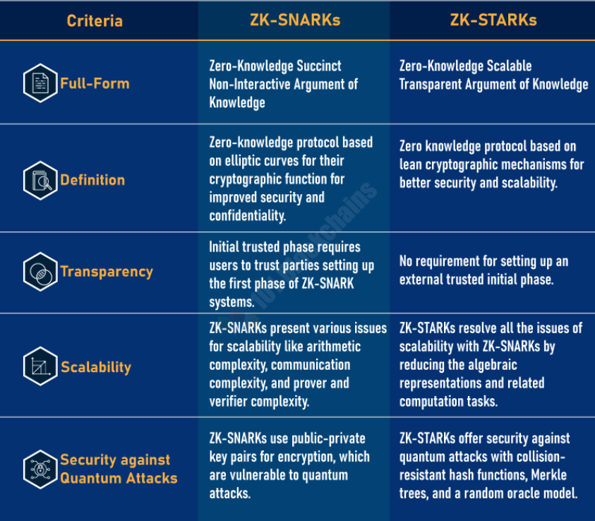
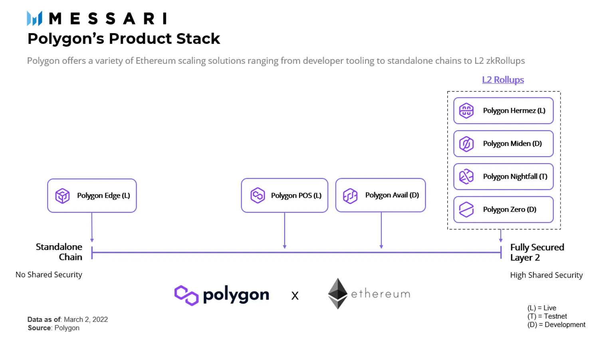

## Question 1

>  Celestia is set out to be the consensus and data availability layer for blockchains. Chains built on top of Celestia can concentrate on execution. Do you think data availability is the true bottleneck to scale blockchain? Argue for and against the need for the data availability layer for blockchain.

<!--
https://medium.com/blockchain-capital-blog/wtf-is-data-availability-80c2c95ded0f
https://github.com/celestiaorg
https://coinyuppie.com/why-is-data-availability-critical-to-blockchain-scaling/
https://medium.com/zeroknowledge/data-availability-scaling-blockchains-852f9a54fe54
https://blog.celestia.org/ethereum-off-chain-data-availability-landscape/
-->

data availability is the true bottleneck to scale blockchain. Because rollup is an important Blockchain Scalability Solution to solve the blockchain trilemma , rollup's work depends on data availability. without data availability, rollup will not work.

Argue for data availability layer for blockchain:

1. for rullup, guaranteeing data availability allows us to ensure rollup sequencers behave, and maximizing the data space throughput of a data availability solution/layer is crucial if rollups are to maximize their transaction throughput
2. In Celestia, decoupling the consensus and application execution layers, so Celestia modularizes the blockchain technology stack and unlocks new possibilities for decentralized application builders, The benefits of this are as follows:

- Developers can effortlessly define their own virtual execution environments; similar to virtual machines
- Each application gets its own sovereign execution space, while inheriting the security of Celestia's consensus
- Applications can be updated without main chain hard forks

against the need for the data availability layer:

- separated L2s, sidechains will damage composability

## Question 2

>  Another popular zero knowledge technology in the market today is zk-STARKs. Starkware uses this technology to power dApps such as DiversiFi, ImmutableX, dYdX, etc.. List some advantages of zk-Starks over zk-Snarks. In your opinion, which one is better and why?

<!--
https://101blockchains.com/zksnarks-vs-zkstarks
https://www.reddit.com/r/ethereum/comments/s0j8jo/zk_technology_comparison_zksnarks_loopring_vs/
zk-Starks vs zk-Snarks
技术属性
生态
安全是第一等公民。
 -->
advantages of zk-Starks over zk-Snarks:

1.  No trusted setup required
2.  More scalable in terms of computational speed
3.  Quantum resistant

In your opinion, zk-Snarks is better. The reasons are as follows:

1. Smaller proof size
2. Smaller verification time
3. The larger ecosystem(more tools and libraries, bigger community, more applications)

<!--  -->

## Question 3

> Write in brief ( 1- 2 line for each) about the polygon’s product stack. Refer this Polygons ZK Product Overview

<!--
https://messari.io/article/polygon-a-multi-sided-approach-to-zk-scaling
 -->

polygon: a POS sidechain to scale ethereum

Polygon Nightfall: public-facing privacy-focused rollup for enterprises

Polygon Hermez: decentered ZK Rollup and ZK EVM

Polygon Zero:  accelerator for ZK Proofs in Polygon ecosystem

Polygon Miden: provide zk-STARKs solution and environment in Polygon ecosystem

Polygon Avail: Avail is a data availability-specific blockchain designed for standalone chains, sidechains, and other scaling technologies

Polygon Edge:  A open-source modular blockchain development framework for customized chains  

<!-- Polygon Studios: blockchain games Studios -->

## Question 4

> Write in brief (at least 4 -5 lines) about your learnings throughout the course.

1. finish 5 assignments( week1, week2, week3, week4, week7)
2. Familiar with circom language
3. basic zk knowledge
4. the basic knowledge and skills of developing zkapp
5. Familiar with The  principles and code  of zksync
6. write rust code in production
7. open a door to the state-of-art zkp technology

## Question 5

>  Provide 2 - 3 ideas for your final project. Explain the pros and cons of each idea. Also, provide a draft proposal for the idea of your liking. Refer here for samples.

<!--
https://talk.harmony.one/c/funding-proposals/zkdao/84

https://github.com/celo-org/plumo-prover

https://www.youtube.com/watch?v=2e0XpWgFKLg

 -->

### idea: port Plumo to harmony

The references are as follows:

1. [plumo-prover](https://github.com/celo-org/plumo-prover)
2. [plumo-verifier](https://github.com/celo-org/plumo-verifier)
3. [plumo-verifier-web](https://github.com/celo-org/plumo-verifier-web)
4. [plumo-ceremony-attestations](https://github.com/celo-org/plumo-ceremony-attestations)
5. [Plumo Ultralight Sync](https://docs.celo.org/celo-codebase/protocol/plumo)

pros:

- quick verification of the chain syncing computation without having to run it locally
- fastly sync blockchain with less data
- reduce harmony node's cost

cons:

- Mass adaptation with harmony's code
- plumo without large-scale application and verification, there are certain technical risks
- Increase the difficulty of setuping harmony nodes(Plumo setup is required)

### idea: bridging between polygon with  harmony

According to Horizon,  building a bridge between polygon with harmony.

The references are as follows:

[Horizon repository.](https://github.com/harmony-one/horizon)

[Horizon Bridge SDK](https://github.com/harmony-one/ethhmy-bridge.sdk)

pros:

- trustless
- safety and reliable(Horizon has been running for over a year)

cons:

- Non-universal solution, requires building a bridge for each chain
- Not fully decentralized
